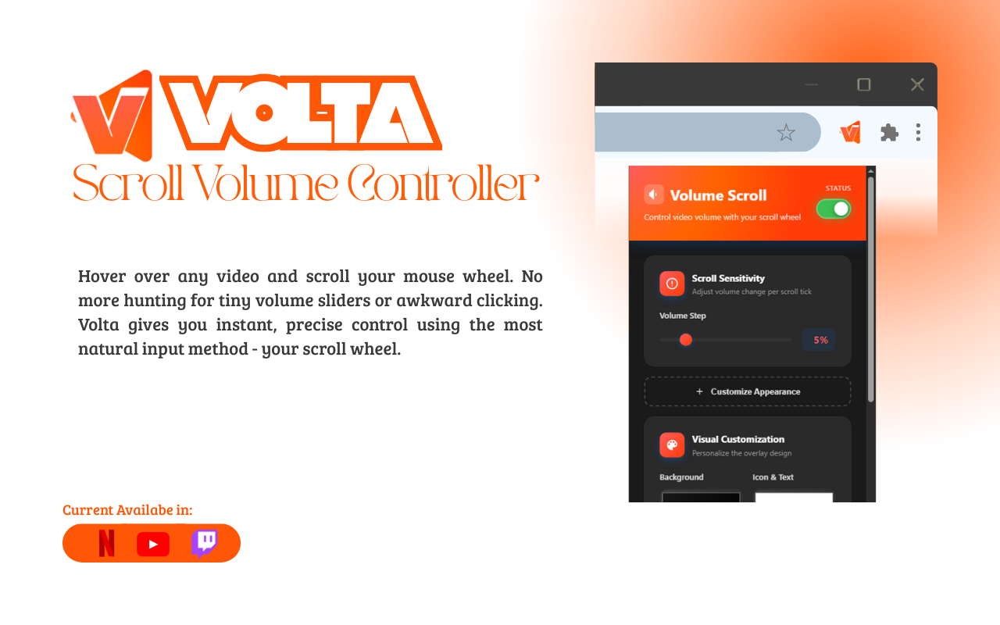
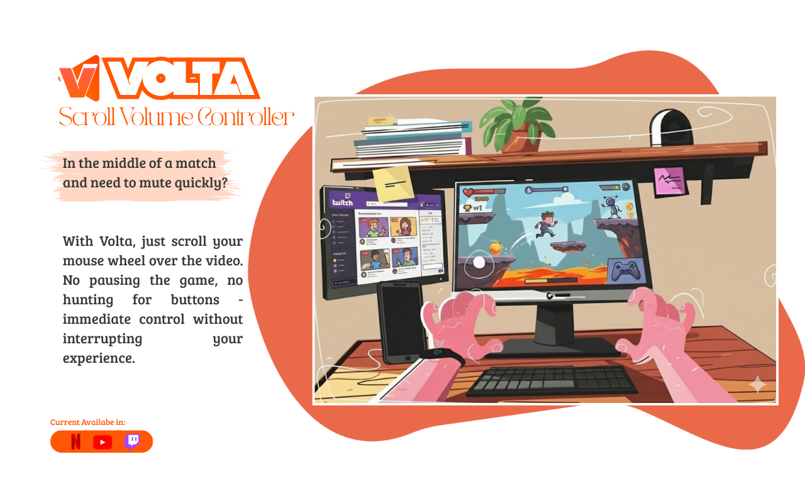

# Volta

Control video volume with your mouse wheel. Works on YouTube, Twitch, and Netflix.

<p align="center">
  <a href="https://chromewebstore.google.com/detail/volta-scroll-volume-contr/ekkkmkejlkfjfdjingbmmagnncglbgao">
    
  </a>
  <a href="LICENSE">
    
  </a>
</p>

## Screenshots

<p align="center">
  
  
</p>

## What it does

Hover your mouse over any video and scroll to change the volume. That's it.

A small overlay pops up showing the current volume level. The icon changes based on how loud it is. Works in fullscreen too - no need to exit or hunt for controls.

## Why I made this

I got tired of:
- Trying to click those tiny volume sliders
- Exiting fullscreen just to adjust volume
- Missing that perfect volume level because the slider jumped too far

Your mouse wheel is already perfect for this. It just needed to work.

## Install

**From Chrome Web Store:** [Install Volta](https://chromewebstore.google.com/detail/volta-scroll-volume-contr/ekkkmkejlkfjfdjingbmmagnncglbgao)

**From source:**
```bash
git clone https://github.com/Dpinto9/Extension_scroll-volume-videos.git
```
Then go to `chrome://extensions/`, enable Developer mode, and load the folder.

## Settings

Click the extension icon to customize:

- **Scroll sensitivity** - From 1% to 25% volume change per scroll
- **Overlay colors** - Make it yours
- **Opacity** - How visible the overlay is
- **Live preview** - See changes as you make them

## Works on

- YouTube
- Twitch  
- Netflix

The extension syncs with each platform's native controls, so everything stays consistent.

## How it works

When you scroll over a video, Volta catches that scroll event and adjusts the volume instead of scrolling the page. The overlay appears for a couple seconds then fades out.

Everything runs locally in your browser. No data leaves your computer. No tracking. No analytics.

## Privacy

- All processing happens on your device
- Zero data collection
- No external connections
- No tracking of any kind

Open source so you can verify this yourself.

## Contributing

Found a bug? Want to add a feature? PRs welcome.

The code is vanilla JavaScript - no build tools, no frameworks. Just open it up and start editing.

## License

MIT - do whatever you want with it.

## Issues

Something not working? [Open an issue](https://github.com/Dpinto9/Extension_scroll-volume-videos/issues) and I'll take a look.

---

<p align="center">Made because I was annoyed at video players</p>
